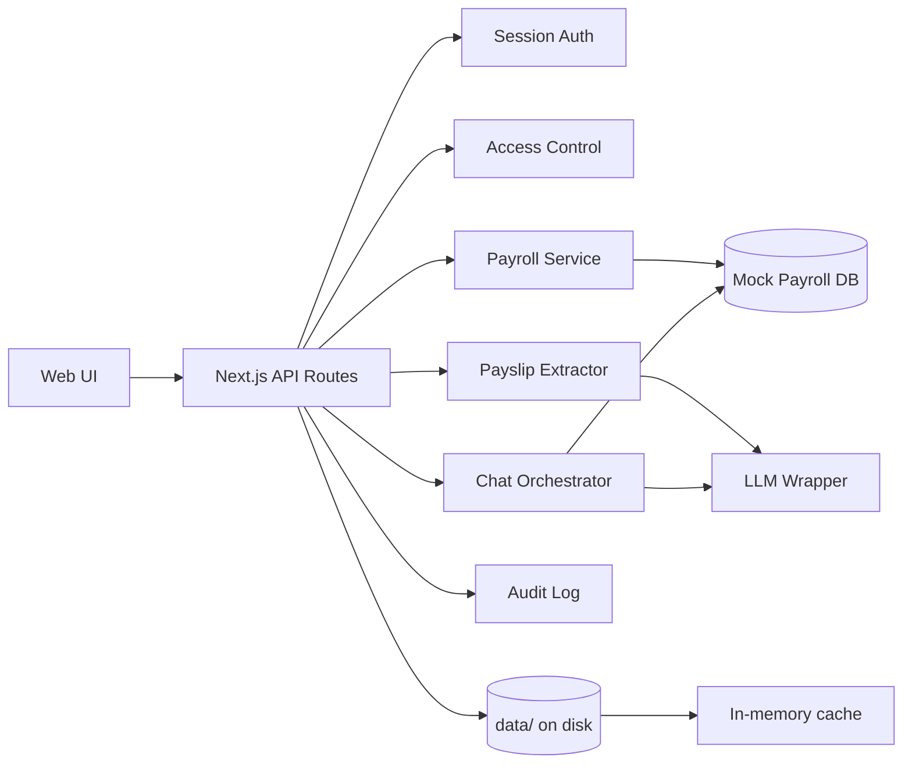

# FinWell AI — Personalized Financial Wellness & Tax Assistant

AI-powered employee financial wellness prototype that helps staff understand salary structure, deductions, reimbursements, year-to-date payroll values, and basic tax-saving opportunities. Built for the **Lead Engineer** assignment: *Personalized Financial Wellness & Tax AI Agent*.

## Features

| Feature | Description |
|---------|-------------|
| **Payslip Upload & OCR** | Upload PDF/image payslips; LLM-based extraction via provided wrapper, with mock OCR fallback |
| **Payroll Overview** | Structured monthly breakup — basic, HRA, LTA, PF, TDS, reimbursements, net pay, YTD |
| **AI Assistant** | Document-grounded Q&A with hallucination safeguards and source references |
| **Tax Simulator** | Estimate impact of additional 80C / 80D / home loan interest with step-by-step breakdown |
| **Proof Checklist** | Personalized investment proof checklist from tax declarations |
| **Payslip Comparison** | Month-over-month diff for earnings, deductions, and net pay |
| **Access Control** | User-level auth; employees see only their data; admin gets sanitized summary |
| **Audit Logging** | Upload, query, view, and admin actions logged |

## Quick Start

```bash
npm install
cp .env.example .env.local   # optional: add LLM_API_TOKEN for live AI/OCR
npm run dev
```

Open [http://localhost:3000](http://localhost:3000)

### Demo Accounts

| Email | Password | Role |
|-------|----------|------|
| john.doe@company.com | employee123 | Employee (EMP001) |
| psachan190@gmail.com | employee123 | Employee (EMP002) — no payroll data yet |
| payroll.admin@company.com | admin123 | Payroll Admin |

## Architecture

```
app/
├── api/                    # REST API layer
│   ├── auth/               # Login, logout, session
│   ├── payroll/            # Structured payroll queries
│   ├── payslips/           # Upload, compare
│   ├── chat/               # AI Q&A orchestration
│   ├── tax/simulate/       # Tax-saving simulation
│   ├── checklist/          # Investment proof checklist
│   └── audit/              # Audit log (admin)
├── dashboard/              # Main employee UI
└── login/                  # Authentication UI

lib/
├── types/                  # Domain models
├── db/                     # File-based persistence wrapper + repositories
├── data/                   # Mock payroll + in-memory cache (hydrated from disk)
├── auth/                   # Session/token management
├── security/               # Access control & authorization
├── payroll/                # Payroll query & comparison logic
├── tax/                    # Simulator & checklist generator
├── ocr/                    # Payslip extraction (LLM + mock)
├── ai/                     # LLM client, prompts, chat orchestration
└── audit/                  # Audit logging
```

### Data Flow



## File Storage & Persistence

Runtime reads use **in-memory caches** for speed. Every write is persisted to disk under `data/` (configurable via `DATA_DIR`). On server restart, stores are **automatically rehydrated** from files.

```
data/
├── sessions/               # One JSON file per auth session
│   └── {token}.json
├── uploads/                # Payslip uploads per employee
│   └── {employeeId}/
│       └── {uploadId}/
│           ├── metadata.json    # Extracted fields, status, filename
│           ├── payslip.pdf      # Original uploaded file (binary)
│           └── ocr-text.txt     # Raw OCR/LLM output (optional)
├── chat/                   # Chat history per user
│   └── {userId}.json
└── audit/
    └── logs.json           # Append-only audit trail
```

### Database wrapper (`lib/db/`)

| Module | Purpose |
|--------|---------|
| `file-db.ts` | Core JSON/binary read-write, directory management |
| `paths.ts` | Canonical paths under `data/` |
| `repositories/sessions.ts` | Session CRUD |
| `repositories/uploads.ts` | Upload metadata + binary file storage |
| `repositories/chat.ts` | Chat history persistence |
| `repositories/audit.ts` | Audit log persistence |
| `index.ts` | Hydration orchestration |

Mock payroll (`MOCK_PAYROLL` in code) remains static; only **user-generated data** (uploads, sessions, chat, audit) is file-persisted.

## AI & Grounding Strategy

Prompts in `lib/ai/prompts.ts` enforce:

1. **Answer only from provided data** — structured payroll, uploaded payslips, tax declarations
2. **Refusal when data missing** — explicit message to contact Payroll/HR
3. **No invented amounts** — salary/tax figures must come from context
4. **Source references** — responses cite payslip month/field where possible
5. **Fallback mode** — rule-based answers from structured data when `LLM_API_TOKEN` is unset

### LLM Wrapper Integration

Uses the provided endpoint (see `ai-interview-docs.txt`):

```bash
curl -X POST "$LLM_WRAPPER_URL/llm/query" \
  -H "Authorization: Bearer $LLM_API_TOKEN" \
  -H "Content-Type: application/json" \
  -d '{"prompt":"...","pdfBase64":"..."}'
```

Set in `.env.local`:

```
LLM_API_TOKEN=your_token
LLM_WRAPPER_URL=https://llm-wrapper-741152993481.asia-south1.run.app
```

## Security & Privacy (Prototype)

| Control | Implementation |
|---------|----------------|
| Authentication | Bearer token sessions (8h TTL), mock credentials |
| Authorization | `assertEmployeeAccess()` on every employee-scoped endpoint |
| Data isolation | Payroll filtered by `employeeId`; cross-user requests return 403 |
| Admin minimization | Admin sees summary fields only (no full breakup) |
| Sensitive data | Payslips scoped per employee; audit trail for access |
| Production notes | Would use SSO/OIDC, encryption at rest, RBAC, data masking |

## API Reference

All endpoints require `Authorization: Bearer <token>` except login.

| Method | Endpoint | Description |
|--------|----------|-------------|
| POST | `/api/auth/login` | `{ email, password }` → token + user |
| GET | `/api/auth/me` | Current user |
| POST | `/api/auth/logout` | Invalidate session |
| GET | `/api/payroll` | Employee payroll records |
| POST | `/api/payslips/upload` | Multipart: `file`, `useMockOcr` |
| GET | `/api/payslips/compare?monthA&yearA&monthB&yearB` | Compare two periods |
| POST | `/api/chat` | `{ question }` → grounded answer + sources |
| POST | `/api/tax/simulate` | `{ additional80C, additional80D, homeLoanInterest }` |
| GET | `/api/checklist` | Investment proof checklist |
| GET | `/api/audit` | Audit logs (admin) |

## Tax Simulation Assumptions

- Simplified Indian income tax slabs (illustrative, **not for compliance**)
- Standard deduction ₹50,000; 80C limit ₹1,50,000; 80D limit ₹25,000
- Annual gross = latest monthly gross × 12
- Does not model HRA exemption, LTA rules, or regime selection in full

## Testing

```bash
npm test
```

Covers:

- Unauthorized cross-user access
- Payslip comparison logic
- Tax simulation & step breakdown
- Checklist generation for missing proofs
- Payslip field validation (inconsistent net pay)
- Edge cases (unknown employee, capped 80C)

## Known Limitations

- Mock payroll data (not connected to real HRIS)
- File-based storage (not a production RDBMS); suitable for prototype/demo
- Simplified tax logic — documented assumptions apply
- OCR falls back to mock sample without LLM token
- No production encryption, compliance certification, or real SSO

## Scripts

```bash
npm run dev      # Development server
npm run build    # Production build
npm run start    # Production server
npm run lint     # ESLint
npm test         # Unit tests
```

## Tech Stack

- **Next.js 16** (App Router) + **React 19** + **TypeScript**
- **Tailwind CSS 4**
- **Vitest** for unit tests
- **LLM Wrapper** for AI/OCR (optional)
