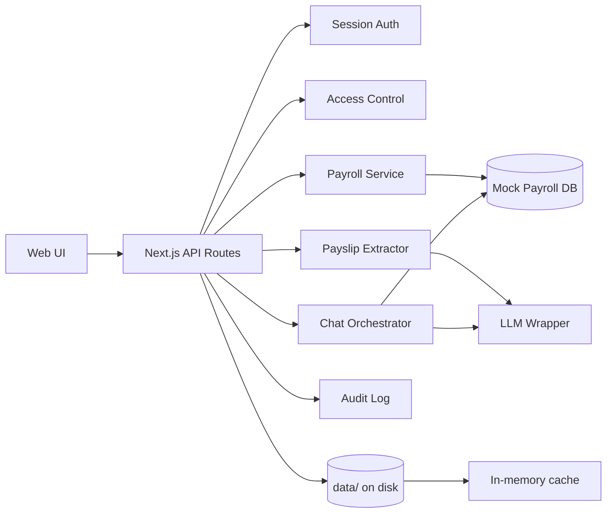

# FinWell AI — Personalized Financial Wellness & Tax Assistant

AI-powered employee financial wellness prototype that helps staff understand salary structure, deductions, reimbursements, year-to-date payroll values, and basic tax-saving opportunities. Built for the **Lead Engineer** assignment: *Personalized Financial Wellness & Tax AI Agent*.

## Features

| Feature | Description |
|---------|-------------|
| **Payslip Upload & OCR** | Upload PDF/image payslips; LLM-based extraction via provided wrapper, with mock OCR fallback |
| **Payroll Overview** | Structured monthly breakup — basic, HRA, LTA, PF, TDS, reimbursements, net pay, YTD |
| **AI Assistant** | Document-grounded Q&A with hallucination safeguards and source references |
| **Tax Simulator** | Estimate impact of additional 80C / 80D / home loan interest with step-by-step breakdown |
| **Proof Checklist** | Personalized investment proof checklist from tax declarations |
| **Payslip Comparison** | Month-over-month diff for earnings, deductions, and net pay |
| **Access Control** | User-level auth; employees see only their data; admin gets sanitized summary |
| **Audit Logging** | Upload, query, view, and admin actions logged |

## Documentation

| Document | Description |
|----------|-------------|
| [README.md](./README.md) | Setup, API reference, deployment, demo accounts |
| [docs/PROJECT_DOCUMENTATION.md](./docs/PROJECT_DOCUMENTATION.md) | Overview, HLD, LLD, interview Q&A (20 questions with answers) |

## Quick Start

```bash
npm install
cp .env.example .env.local   # optional: add LLM_API_TOKEN for live AI/OCR
npm run dev
```

Open [http://localhost:3000](http://localhost:3000)

## Demo Walkthrough (~5 min)

Recommended flow for reviewers:

| Step | Account | Tab | What to show |
|------|---------|-----|--------------|
| 1 | `john.doe@company.com` | **Payroll** | 3 months structured data, YTD, earnings/deductions |
| 2 | John | **AI Assistant** | Ask *"What is my net pay in March?"* — grounded answer with sources |
| 3 | John | **Tax Simulator** | Baseline loads automatically; run *Max 80C* preset; show old vs new regime |
| 4 | John | **Checklist** | Pending proof items from tax declaration |
| 5 | John | **Compare** | Feb vs Mar payslip diff |
| 6 | `psachan190@gmail.com` | **Upload** | Upload a payslip PDF; show OCR extraction → payroll populates |
| 7 | Prashant | **Payroll / Chat** | Data from uploads only (no mock payroll) |
| 8 | `payroll.admin@company.com` | **Admin** | Audit logs, sanitized employee summary |

**Tips:** Demo accounts are one-click on the login page. Set `LLM_API_TOKEN` in `.env.local` for live AI/OCR; without it, mock fallback still works.

### Demo Accounts

| Email | Password | Role |
|-------|----------|------|
| john.doe@company.com | employee123 | Employee (EMP001) |
| psachan190@gmail.com | employee123 | Employee (EMP002) — no payroll data yet |
| payroll.admin@company.com | admin123 | Payroll Admin |

## Architecture

```
app/
├── api/                    # REST API layer
│   ├── auth/               # Login, logout, session
│   ├── payroll/            # Structured payroll queries
│   ├── payslips/           # Upload, compare
│   ├── chat/               # AI Q&A orchestration
│   ├── tax/simulate/       # Tax-saving simulation
│   ├── checklist/          # Investment proof checklist
│   └── audit/              # Audit log (admin)
├── dashboard/              # Main employee UI
└── login/                  # Authentication UI

lib/
├── types/                  # Domain models
├── db/                     # File-based persistence wrapper + repositories
├── data/                   # Mock payroll + in-memory cache (hydrated from disk)
├── auth/                   # Session/token management
├── security/               # Access control & authorization
├── payroll/                # Payroll query & comparison logic
├── tax/                    # Simulator & checklist generator
├── ocr/                    # Payslip extraction (LLM + mock)
├── ai/                     # LLM client, prompts, chat orchestration
└── audit/                  # Audit logging
```

### Data Flow



## File Storage & Persistence

Runtime reads use **in-memory caches** for speed. Every write is persisted to disk under `data/` (configurable via `DATA_DIR`). On server restart, stores are **automatically rehydrated** from files.

```
data/
├── sessions/               # One JSON file per auth session
│   └── {token}.json
├── uploads/                # Payslip uploads per employee
│   └── {employeeId}/
│       └── {uploadId}/
│           ├── metadata.json    # Extracted fields, status, filename
│           ├── payslip.pdf      # Original uploaded file (binary)
│           └── ocr-text.txt     # Raw OCR/LLM output (optional)
├── chat/                   # Chat sessions per user
│   └── {userId}/
│       └── {sessionId}.json
└── audit/
    └── logs.json           # Append-only audit trail
```

### Database wrapper (`lib/db/`)

| Module | Purpose |
|--------|---------|
| `file-db.ts` | Core JSON/binary read-write, directory management |
| `paths.ts` | Canonical paths under `data/` |
| `repositories/sessions.ts` | Session CRUD |
| `repositories/uploads.ts` | Upload metadata + binary file storage |
| `repositories/chat-sessions.ts` | Chat history persistence |
| `repositories/audit.ts` | Audit log persistence |
| `index.ts` | Hydration orchestration |

Mock payroll (`MOCK_PAYROLL` in code) remains static; only **user-generated data** (uploads, sessions, chat, audit) is file-persisted.

## AI & Grounding Strategy

Prompts in `lib/ai/prompts.ts` enforce:

1. **Answer only from provided data** — structured payroll, uploaded payslips, tax declarations
2. **Refusal when data missing** — explicit message to contact Payroll/HR
3. **No invented amounts** — salary/tax figures must come from context
4. **Source references** — responses cite payslip month/field where possible
5. **Fallback mode** — rule-based answers from structured data when `LLM_API_TOKEN` is unset

### LLM Wrapper Integration

Uses the provided endpoint (see `ai-interview-docs.txt`):

```bash
curl -X POST "$LLM_WRAPPER_URL/llm/query" \
  -H "Authorization: Bearer $LLM_API_TOKEN" \
  -H "Content-Type: application/json" \
  -d '{"prompt":"...","pdfBase64":"..."}'
```

Set in `.env.local`:

```
LLM_API_TOKEN=your_token
LLM_WRAPPER_URL=https://llm-wrapper-741152993481.asia-south1.run.app
```

## Security & Privacy (Prototype)

| Control | Implementation |
|---------|----------------|
| Authentication | Bearer token sessions (8h TTL), mock credentials |
| Authorization | `assertEmployeeAccess()` on every employee-scoped endpoint |
| Rate limiting | Login endpoint throttled (10 attempts / 15 min per IP) |
| Security headers | X-Frame-Options, nosniff, HSTS (prod), no-store on API |
| Input validation | Chat length limits, filename sanitization on uploads |
| Data isolation | Payroll filtered by `employeeId`; cross-user requests return 403 |
| Admin minimization | Admin sees summary fields only (no full breakup) |
| Sensitive data | Payslips scoped per employee; audit trail for access |
| Production notes | Would use SSO/OIDC, encryption at rest, RBAC, data masking |

## API Reference

All endpoints require `Authorization: Bearer <token>` except login.

| Method | Endpoint | Description |
|--------|----------|-------------|
| POST | `/api/auth/login` | `{ email, password }` → token + user |
| GET | `/api/auth/me` | Current user |
| POST | `/api/auth/logout` | Invalidate session |
| GET | `/api/payroll` | Employee payroll records |
| POST | `/api/payslips/upload` | Multipart: `file`, `useMockOcr` |
| GET | `/api/payslips/compare?monthA&yearA&monthB&yearB` | Compare two periods |
| POST | `/api/chat/messages` | `{ question, sessionId? }` — creates session on first message if omitted |
| POST | `/api/chat/sessions` | Create session manually (optional) |
| GET | `/api/chat/sessions` | List user's chat sessions |
| GET | `/api/chat/sessions/{id}` | Get session with message history |
| DELETE | `/api/chat/sessions/{id}` | Delete a chat session |
| POST | `/api/chat/sessions/{id}/messages` | `{ question }` → grounded answer + sources |
| GET | `/api/tax/simulate` | Tax baseline — declaration, regime comparison, slab breakdown |
| POST | `/api/tax/simulate` | `{ regime?, additional80C, additional80D, additionalNps, homeLoanInterest }` |
| GET | `/api/checklist` | Investment proof checklist |
| GET | `/api/audit` | Audit logs (admin) |
| GET | `/api/health` | Health check (no auth) — for Docker/K8s probes |

## Production Deployment

### Docker

```bash
# Build and run with persistent data volume
docker compose up --build -d

# Or build manually
docker build -t finwell-ai .
docker run -p 3000:3000 \
  -e LLM_API_TOKEN=your_token \
  -v finwell-data:/app/data \
  finwell-ai
```

Health check: `GET /api/health` returns `{ status: "ok", llmConfigured, warnings }`.

Mount `DATA_DIR` (default `/app/data` in container) to persist uploads, sessions, chat, and audit logs across restarts.

### CI / Quality Gates

GitHub Actions runs on push/PR: **lint → typecheck → test → build**.

```bash
npm run ci           # Full local quality gate
npm run typecheck    # TypeScript check
npm run test:coverage
```

## Tax Simulation Assumptions

- **Old vs new regime** comparison with illustrative slab rates
- **Old regime**: Section 80C, 80D, HRA exemption, home loan interest, standard deduction
- **New regime**: Standard deduction only (80C/80D/HRA not applied)
- **HRA exemption**: min(rent − 10% basic, 50% basic metro, HRA received)
- **80CCD(1B) NPS**: additional ₹50,000 beyond 80C limit
- Simplified Indian income tax slabs (illustrative, **not for compliance**)
- Standard deduction ₹50,000; 80C limit ₹1,50,000; 80D limit ₹25,000
- Annual gross = latest monthly gross × 12
- Does not model full LTA rules or regime selection filing constraints

## Testing

```bash
npm test              # All unit tests
npm run test:coverage # With coverage report
```

**Test suites** (`tests/`):

| File | Coverage |
|------|----------|
| `finwell.test.ts` | Access control, payroll, tax sim, checklist, payslip validation |
| `file-db.test.ts` | File persistence, session/upload reload after restart |
| `auth.test.ts` | Login credentials, session create/destroy/expiry |
| `security.test.ts` | Rate limiting, input validation, env warnings |
| `chat-sessions.test.ts` | Chat isolation, title derivation, disk persistence |

## Known Limitations

- Mock payroll data (not connected to real HRIS)
- File-based storage (not a production RDBMS); suitable for prototype/demo
- Simplified tax logic — documented assumptions apply
- OCR falls back to mock sample without LLM token
- No production encryption, compliance certification, or real SSO

## Scripts

```bash
npm run dev          # Development server
npm run build        # Production build
npm run start        # Production server
npm run lint         # ESLint
npm run typecheck    # TypeScript
npm test             # Unit tests
npm run ci           # Lint + typecheck + test + build
docker compose up    # Run in Docker
```

## Tech Stack

- **Next.js 16** (App Router) + **React 19** + **TypeScript**
- **Tailwind CSS 4**
- **Vitest** for unit tests
- **LLM Wrapper** for AI/OCR (optional)
