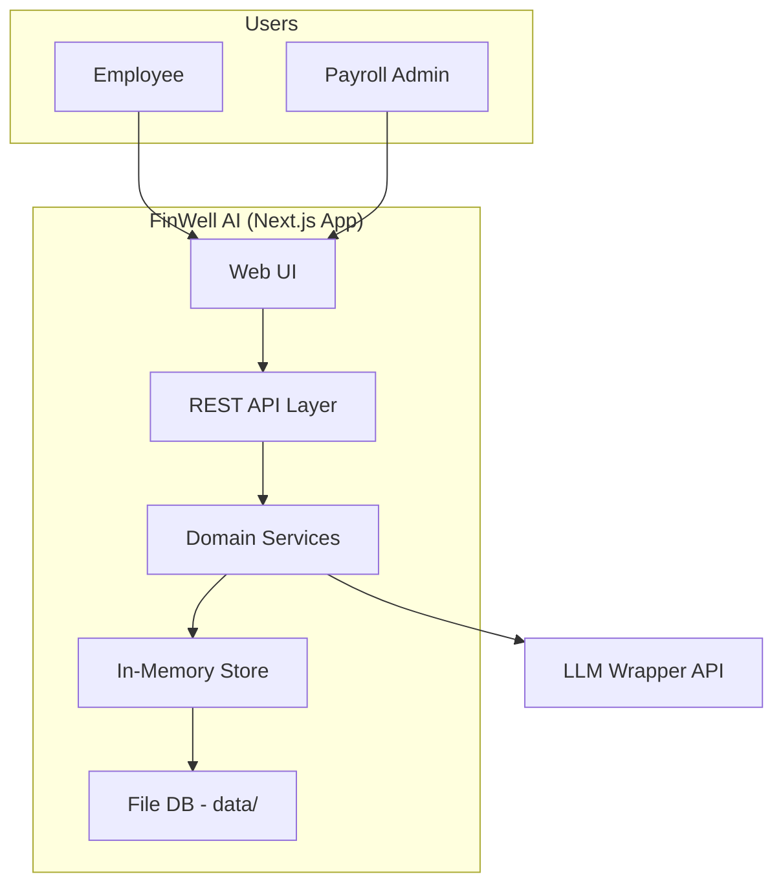
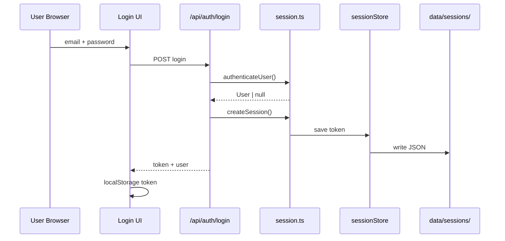
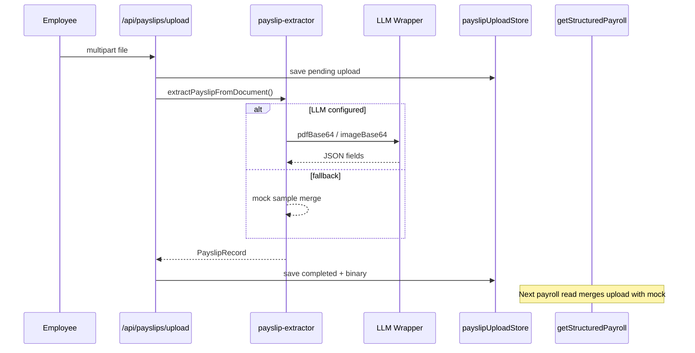
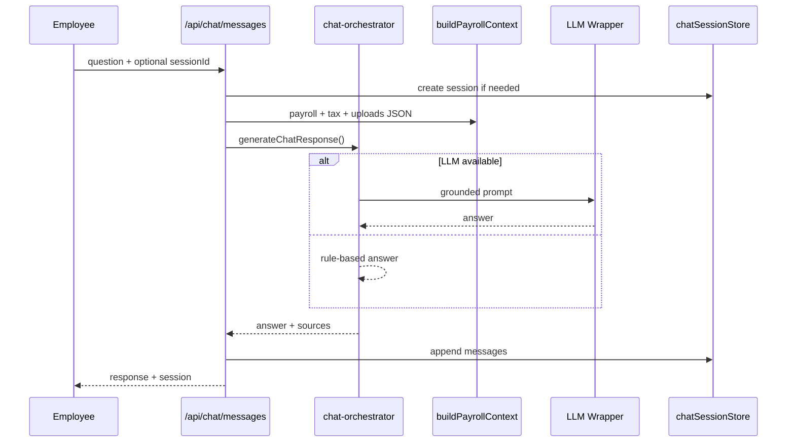
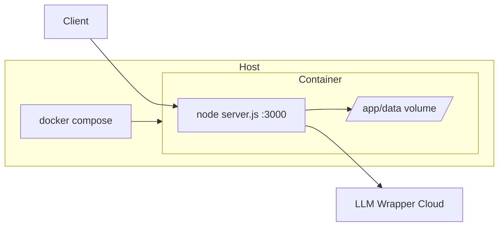
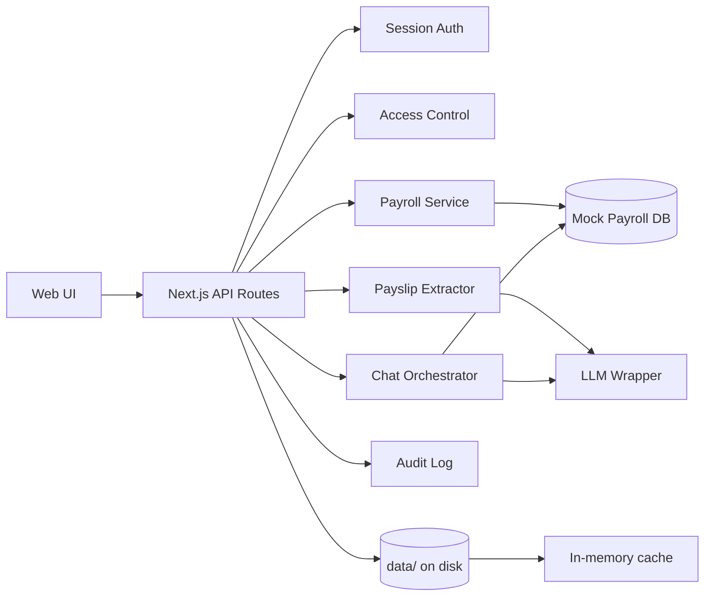
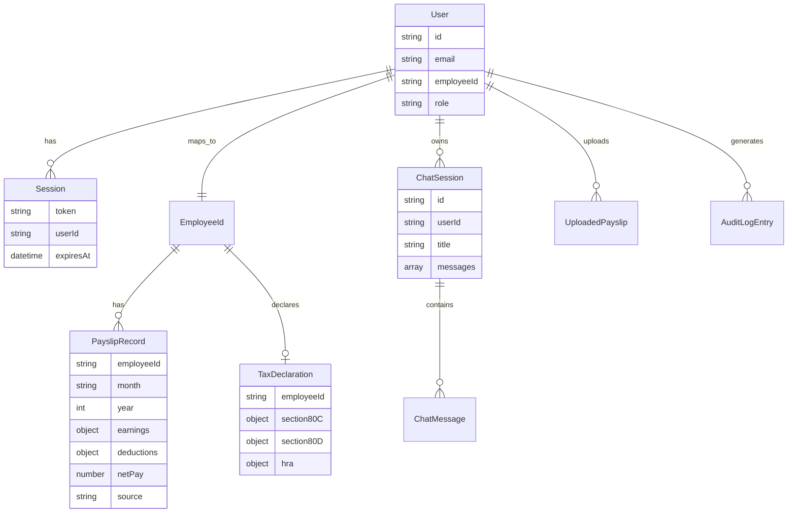
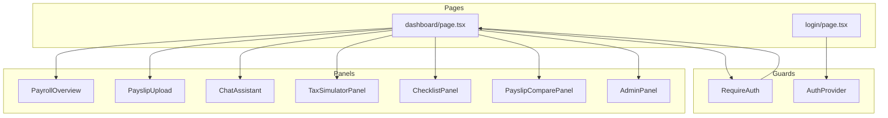

# FinWell AI — Project Documentation

> Personalized Financial Wellness & Tax AI Agent
> Lead Engineer assignment prototype

---

## Table of Contents

1. [Executive Summary](#1-executive-summary)
2. [Detailed Overview](#2-detailed-overview)
3. [Key Notes](#3-key-notes)
4. [Interview Questions & Answers](#4-interview-questions--answers)
5. [High-Level Design (HLD)](#5-high-level-design-hld)
6. [Low-Level Design (LLD)](#6-low-level-design-lld)
7. [Quick Reference](#7-quick-reference)

---

## 1. Executive Summary

**FinWell AI** is a **Personalized Financial Wellness & Tax AI Agent** built as a Lead Engineer assignment prototype. It helps employees understand payroll (salary breakup, deductions, YTD), upload payslips via OCR/LLM, ask grounded questions about their finances, simulate tax savings, track investment proof deadlines, and compare payslips month-over-month.

| Attribute   | Value                                                  |
| ----------- | ------------------------------------------------------ |
| **Stack**   | Next.js 16, React 19, TypeScript, Tailwind CSS 4       |
| **AI**      | External LLM wrapper (chat + OCR); rule-based fallback |
| **Storage** | File-based persistence (`data/`) + in-memory cache     |
| **Auth**    | Bearer token sessions (8h TTL), mock users             |
| **Tests**   | 53 unit tests (Vitest), CI on GitHub Actions           |
| **Deploy**  | Docker, docker-compose, `/api/health`                  |

**Purpose:** Demonstrate end-to-end product thinking — domain modeling, secure APIs, AI grounding, persistence, and production-oriented packaging — without connecting to a real HRIS.

---

## 2. Detailed Overview

### 2.1 Problem Statement

Employees struggle to understand payslips, tax deductions, and tax-saving options. HR/Payroll teams need self-service tools that reduce repetitive queries while keeping data private and auditable.

### 2.2 Solution

A web application that provides:

1. **Payroll overview** — structured monthly data (mock + uploaded)
2. **Payslip upload** — PDF/image → LLM extraction → merged payroll
3. **AI assistant** — Q&A grounded in payroll, uploads, tax declarations
4. **Tax simulator** — old vs new regime, 80C/80D/NPS/home loan scenarios
5. **Investment checklist** — proof status from declarations
6. **Payslip comparison** — month-over-month diffs
7. **Admin panel** — audit logs, sanitized payroll summary

### 2.3 User Roles

| Role         | Capabilities                                                                       |
| ------------ | ---------------------------------------------------------------------------------- |
| **Employee** | Own payroll, upload, chat, tax, checklist, compare                                 |
| **Admin**    | Audit logs, sanitized cross-employee summary; employee features gated on some tabs |

### 2.4 Demo Accounts

| Email                       | Password      | Profile                                      |
| --------------------------- | ------------- | -------------------------------------------- |
| `john.doe@company.com`      | `employee123` | EMP001 — full mock payroll + tax declaration |
| `psachan190@gmail.com`      | `employee123` | EMP002 — upload-only, no mock payroll        |
| `payroll.admin@company.com` | `admin123`    | Admin — audit + summary views                |

### 2.5 Demo Walkthrough (~5 min)

| Step | Account                     | Tab                | What to show                                                               |
| ---- | --------------------------- | ------------------ | -------------------------------------------------------------------------- |
| 1    | `john.doe@company.com`      | **Payroll**        | 3 months structured data, YTD, earnings/deductions                         |
| 2    | John                        | **AI Assistant**   | Ask _"What is my net pay in March?"_ — grounded answer with sources        |
| 3    | John                        | **Tax Simulator**  | Baseline loads automatically; run _Max 80C_ preset; show old vs new regime |
| 4    | John                        | **Checklist**      | Pending proof items from tax declaration                                   |
| 5    | John                        | **Compare**        | Feb vs Mar payslip diff                                                    |
| 6    | `psachan190@gmail.com`      | **Upload**         | Upload a payslip PDF; show OCR extraction → payroll populates              |
| 7    | Prashant                    | **Payroll / Chat** | Data from uploads only (no mock payroll)                                   |
| 8    | `payroll.admin@company.com` | **Admin**          | Audit logs, sanitized employee summary                                     |

### 2.6 Tech Layers

```
┌─────────────────────────────────────────────────────────┐
│  Presentation (React)                                    │
│  login, dashboard tabs, auth-provider                    │
├─────────────────────────────────────────────────────────┤
│  API (Next.js Route Handlers)                            │
│  auth, payroll, payslips, chat, tax, checklist, audit    │
├─────────────────────────────────────────────────────────┤
│  Domain Services (lib/)                                  │
│  payroll, tax, ocr, ai, security, auth, audit            │
├─────────────────────────────────────────────────────────┤
│  Persistence                                             │
│  store.ts (cache) ↔ repositories ↔ file-db ↔ data/     │
├─────────────────────────────────────────────────────────┤
│  External                                                │
│  LLM Wrapper API (optional)                              │
└─────────────────────────────────────────────────────────┘
```

---

## 3. Key Notes

### 3.1 Design Decisions

- **Mock + uploaded payroll merge:** `getStructuredPayroll()` combines `MOCK_PAYROLL` with OCR-extracted payslips; uploads override the same month/year.
- **Write-through cache:** Every store write goes to disk; reads use `globalThis.__finwellStore` hydrated once per process.
- **Chat sessions on first message:** Avoids empty session clutter; title derived from first question.
- **AI grounding:** Prompts inject payroll JSON, tax declaration, uploads; fallback rules when LLM unavailable or token missing.
- **Tax logic is illustrative:** Slab rates simplified; documented as non-compliance.

### 3.2 Security (Prototype Level)

- Bearer auth on protected routes
- `assertEmployeeAccess()` for employee-scoped data
- Login rate limit (10 attempts / 15 min / IP)
- Security headers via middleware
- Filename sanitization, chat length limits
- Audit trail for sensitive actions

### 3.3 Known Limitations

- No real SSO, encryption at rest, or HRIS integration
- File DB not suitable for high concurrency or multi-instance writes
- Admin cannot use employee-only tabs (by design for demo)
- EMP002 has minimal checklist (no full tax declaration in mock data)
- Tax simulation is illustrative only — not for compliance or filing

### 3.4 How to Run

```bash
npm install
cp .env.example .env.local   # optional: LLM_API_TOKEN for live AI/OCR
npm run dev                  # http://localhost:3000
npm run ci                   # lint + typecheck + test + build
docker compose up --build -d # production container
```

---

## 4. Interview Questions & Answers

Use this section to prepare for technical review or Lead Engineer interviews. Each answer reflects how **this codebase** actually works.

---

### Architecture & Design

#### Q1. Why file-based storage instead of PostgreSQL for this prototype?

**Answer:** File storage keeps the assignment self-contained — no external DB to install, configure, or pay for. The `lib/db/` layer (repositories + `file-db.ts`) abstracts persistence so reads/writes look like a small DB wrapper. Mock payroll stays in code; only user-generated data (uploads, sessions, chat, audit) hits disk. For a demo/assignment this is enough. Production would swap repositories for Postgres/S3 without changing API routes or UI.

---

#### Q2. How would you migrate to a real HRIS without rewriting the UI?

**Answer:** Keep the UI calling the same REST APIs. Replace `MOCK_PAYROLL` and `getStructuredPayroll()` internals with an HRIS adapter (Workday, SAP, custom API). The adapter would implement the same `PayslipRecord` / `TaxDeclaration` types from `lib/types/index.ts`. Upload flow could push to HRIS or stay as a supplemental OCR path. Chat orchestrator already consumes `buildPayrollContext()` — only that builder needs to change data source.

---

#### Q3. What breaks if two server instances share the same `DATA_DIR` volume?

**Answer:** Several things:

- **Race conditions** on concurrent writes to the same JSON file (sessions, chat, audit append).
- **Stale in-memory cache** — each Node process hydrates once; Instance A won't see Instance B's writes until restart.
- **No locking** in `file-db.ts` — last write wins, possible corruption on simultaneous updates.

This architecture assumes **single instance** or read-only scaling. Production needs a shared DB with transactions, or object storage + a proper message queue for writes.

---

#### Q4. Why hydrate to memory instead of reading disk on every request?

**Answer:** Performance and simplicity. Every chat message, payroll view, and session check would hit the filesystem if we read disk per request. `lib/data/store.ts` loads all repositories into `Map`s on first access (`hydrated = false` → `hydrateStores()`), then serves from memory. Writes are **write-through** (memory + disk). Trade-off: faster reads, but memory grows with data and multi-instance sync is not supported — acceptable for a prototype.

---

### Security & Privacy

#### Q5. How is cross-employee data leakage prevented?

**Answer:** Three layers:

1. **Authentication** — `getAuthUser()` on every protected route validates Bearer token via `resolveSession()`.
2. **Authorization** — `assertEmployeeAccess(user, employeeId)` in `lib/security/access-control.ts` blocks employees from other employees' data; admins bypass for summary views only.
3. **Filtering** — `filterPayrollForUser()` returns only records matching `user.employeeId`.

Chat sessions check `session.userId === user.id`. Cross-user API calls return **403 Forbidden**.

---

#### Q6. What happens if a stolen bearer token is reused after logout?

**Answer:** After logout, `POST /api/auth/logout` calls `destroySession(token)` — the token is removed from `sessionStore` and deleted from `data/sessions/{token}.json`. Any subsequent request with that token fails `resolveSession()` and gets **401 Unauthorized**. Tokens also expire after **8 hours** (`SESSION_TTL_MS` in `lib/auth/session.ts`). Limitation: no refresh-token rotation or global revoke-all-sessions — production would add those.

---

#### Q7. What would you add for production (SSO, encryption, PII masking)?

**Answer:**

| Area            | Production addition                                                   |
| --------------- | --------------------------------------------------------------------- |
| Auth            | SSO/OIDC (Azure AD, Okta), MFA                                        |
| Secrets         | Vault / KMS for `LLM_API_TOKEN`, no mock passwords                    |
| Data at rest    | Encrypt `data/` volume or use encrypted DB/blob storage               |
| Data in transit | TLS everywhere, HSTS (partially in middleware today)                  |
| PII             | Mask payslip fields in logs/audit; field-level encryption for uploads |
| RBAC            | Fine-grained roles beyond employee/admin                              |
| Compliance      | GDPR retention policies, consent, data export/delete                  |

Current prototype documents these as known limitations in README and this doc.

---

#### Q8. Why rate-limit only login and not chat/upload?

**Answer:** Login is the highest-risk endpoint for **brute-force** attacks on mock credentials — rate limited to 10 attempts / 15 min / IP in `app/api/auth/login/route.ts` via `lib/security/rate-limit.ts`. Chat and upload are authenticated (token required), so abuse requires a valid session. Production would add rate limits on LLM-heavy routes (chat, OCR) to control cost and DoS. Prototype keeps scope minimal.

---

### AI & Grounding

#### Q9. How do you reduce hallucination in salary/tax answers?

**Answer:** Multiple safeguards in `lib/ai/prompts.ts` and `chat-orchestrator.ts`:

1. **Context injection** — payroll JSON, tax declaration, uploaded payslips passed into every prompt.
2. **Strict prompt rules** — "Answer ONLY from provided data", "NEVER invent amounts", refuse when data missing.
3. **Rule-based fallback** — when LLM unavailable, `answerFromStructuredData()` answers from actual `PayslipRecord` fields (net pay, HRA, PF, TDS).
4. **Source references** — responses include `AnswerSource[]` citing payslip month/field.
5. **Validation** — payslip OCR runs `validatePayslipFields()` for consistency checks.

---

#### Q10. What happens when `LLM_API_TOKEN` is unset?

**Answer:** `isLlmConfigured()` in `lib/ai/llm-client.ts` returns false. Effects:

- **Chat** — falls back to rule-based answers from structured payroll data; UI may show LLM status badge via `/api/config`.
- **OCR** — returns empty/fallback; user can enable **mock OCR** (`useMockOcr=true`) for demo without a token.
- **Health endpoint** — reports `llmConfigured: false` and a warning.

The app remains fully demoable without any external AI dependency.

---

#### Q11. How are answer sources attached to chat responses?

**Answer:** Two paths:

1. **LLM path** — `extractSourcesFromAnswer()` matches answer text against `contextSources` from `buildPayrollContext()`; if no match, returns top 3 context sources.
2. **Fallback path** — `answerFromStructuredData()` explicitly pushes sources when answering (e.g. `{ type: "payslip", reference: "Mar 2025 payslip", field: "netPay" }`).

Sources are stored on `ChatMessage.sources` and rendered in the chat UI.

---

#### Q12. How would you evaluate OCR extraction accuracy?

**Answer:** Not fully implemented in prototype — recommended approach:

1. **Golden dataset** — 20–50 real (anonymized) payslips with human-labeled JSON.
2. **Field-level metrics** — precision/recall per field (basic, HRA, net pay, TDS).
3. **Automated tests** — compare extracted vs expected with tolerance for rounding.
4. **Human review queue** — flag low-confidence extractions for payroll admin.
5. **Regression on prompt/model changes** — run golden set in CI.

Current code has `validatePayslipFields()` for internal consistency (e.g. net pay vs earnings − deductions) but not accuracy vs ground truth.

---

### Tax Domain

#### Q13. Why separate old vs new regime in the simulator?

**Answer:** Indian tax law offers two regimes with different rules:

- **Old regime** — allows 80C, 80D, HRA exemption, home loan interest (employee investments matter).
- **New regime** — lower slabs but mostly **no** 80C/80D/HRA deductions (only standard deduction).

Employees choosing additional 80C investments only helps under old regime. The simulator in `lib/tax/simulator.ts` compares both so users see which regime is better for their declared position — core to "tax-saving" guidance.

---

#### Q14. How is HRA exemption calculated?

**Answer:** Implemented in `estimateHraExemption()` in `lib/tax/calculator.ts`:

```
exemption = min(
  annualRentPaid − 10% of annualBasic,
  50% of annualBasic (metro) or 40% (non-metro),
  annualHRAReceived
)
```

Uses rent from tax declaration (`hra.rentPaidMonthly × 12`) and basic/HRA from latest payslip. Only applied in **old regime** simulation. Simplified — does not model all metro/non-metro edge cases or proof requirements.

---

#### Q15. What assumptions make this unsuitable for actual tax filing?

**Answer:**

- Illustrative slab rates, not tied to a specific FY notification.
- Annual gross = latest monthly gross × 12 (ignores mid-year hikes, bonuses).
- No full LTA exemption rules, regime lock-in, or surcharge/cess edge cases.
- HRA calculation simplified.
- No Form 16 reconciliation or TDS credit matching.
- Explicitly documented: **"not for compliance"** in UI assumptions and README.

Users must consult a qualified tax professional for filing decisions.

---

### Testing & Operations

#### Q16. What do the 53 tests cover vs what's missing?

**Answer:**

| Covered (53 unit tests)                 | Not covered                                   |
| --------------------------------------- | --------------------------------------------- |
| Access control & ACL                    | End-to-end browser tests (Playwright/Cypress) |
| Payroll merge & compare                 | Full API route integration tests with HTTP    |
| Tax simulator (HRA, slabs, NPS, regime) | Load/performance tests                        |
| Auth session lifecycle                  | LLM/OCR contract tests against live wrapper   |
| File persistence & reload               | Multi-instance concurrency tests              |
| Rate limiting & input validation        | Security penetration testing                  |
| Chat session isolation                  |                                               |

`npm run ci` runs lint + typecheck + test + build. Adequate for prototype; production would add E2E and contract tests.

---

#### Q17. How does `/api/health` support deployment?

**Answer:** `GET /api/health` (no auth) returns:

```json
{
  "status": "ok",
  "timestamp": "...",
  "llmConfigured": true/false,
  "dataDir": "./data",
  "warnings": []
}
```

Used by:

- **Docker HEALTHCHECK** in `Dockerfile` (wget every 30s).
- **docker-compose** healthcheck.
- **K8s/load balancers** — liveness/readiness probes.

`validateProductionEnv()` adds warnings if `LLM_API_TOKEN` or `DATA_DIR` missing in production.

---

#### Q18. What's the Docker persistence story for uploads and chat?

**Answer:**

- Container sets `DATA_DIR=/app/data`.
- `docker-compose.yml` mounts named volume `finwell-data:/app/data`.
- Survives container restart/rebuild — uploads, sessions, chat history, audit logs persist.
- Without volume mount, data is lost on container removal.
- `.gitignore` excludes `/data/*` — runtime data never committed to git.

---

### Product & Completeness

#### Q19. Why two employee personas (John vs Prashant)?

**Answer:** Demonstrates two real-world scenarios:

- **John (EMP001)** — established employee with 3 months mock payroll, full tax declaration, rich chat/tax/checklist demo.
- **Prashant (EMP002)** — new employee with **no mock payroll** — must upload payslips to see data; shows OCR → payroll pipeline and empty-state handling.

Reviewers can see both "full data" and "upload-only" journeys without extra setup.

---

#### Q20. What would you build next for v2?

**Answer:** Prioritized roadmap:

| Priority | Feature                                                   |
| -------- | --------------------------------------------------------- |
| P0       | Real HRIS integration adapter                             |
| P0       | Postgres + S3 for persistence at scale                    |
| P1       | SSO/OIDC authentication                                   |
| P1       | Proof document upload (80C/80D receipts)                  |
| P1       | Tax regime selection + Form 12BB workflow                 |
| P2       | Email/push reminders for proof deadlines                  |
| P2       | Admin dashboard — pending proofs, extraction review queue |
| P2       | OCR accuracy golden-set evaluation pipeline               |
| P3       | Multi-language chat, mobile-responsive PWA                |
| P3       | Analytics — common employee questions for HR insights     |

---

## 5. High-Level Design (HLD)

### 5.1 System Context



### 5.2 Container View

| Container         | Responsibility                                              |
| ----------------- | ----------------------------------------------------------- |
| **Web UI**        | Login, tabbed dashboard, client auth state (`localStorage`) |
| **API Routes**    | HTTP boundary, auth check, validation, audit logging        |
| **Domain Layer**  | Business logic: payroll, tax, OCR, chat orchestration       |
| **Store + Repos** | CRUD abstraction over file system                           |
| **Mock Data**     | Static payroll users, declarations (`mock-payroll.ts`)      |
| **LLM Wrapper**   | External chat + document extraction                         |

### 5.3 Authentication Flow



### 5.4 Payslip Upload & OCR Flow



### 5.5 AI Chat (Grounded Q&A) Flow



### 5.6 Deployment View



| Component      | Notes                                            |
| -------------- | ------------------------------------------------ |
| **Dockerfile** | Multi-stage, standalone Next.js, non-root user   |
| **Health**     | `GET /api/health` — status, LLM config, warnings |
| **CI**         | lint → typecheck → test → build (GitHub Actions) |
| **Env**        | `LLM_API_TOKEN`, `LLM_WRAPPER_URL`, `DATA_DIR`   |

### 5.7 Data Flow (End-to-End)



---

## 6. Low-Level Design (LLD)

### 6.1 Module Map

```
biz2x_assignment/
├── app/
│   ├── api/                    # Route handlers (thin controllers)
│   ├── dashboard/page.tsx      # Tab shell + role gating
│   └── login/page.tsx
├── components/
│   ├── auth-provider.tsx       # Client session state
│   ├── require-auth.tsx        # Route guard
│   └── dashboard/              # Feature panels
├── lib/
│   ├── types/index.ts          # Domain types (single source of truth)
│   ├── data/
│   │   ├── mock-payroll.ts     # Static users, payroll, tax, passwords
│   │   └── store.ts            # In-memory stores + write-through
│   ├── db/
│   │   ├── file-db.ts          # JSON/binary FS operations
│   │   ├── paths.ts            # Canonical paths under DATA_DIR
│   │   ├── index.ts            # hydrateStores()
│   │   └── repositories/       # sessions, uploads, chat, audit
│   ├── auth/session.ts         # Login, token, TTL
│   ├── security/
│   │   ├── access-control.ts   # ACL helpers
│   │   ├── rate-limit.ts
│   │   └── input-validation.ts
│   ├── payroll/queries.ts      # Merge, compare, context builder
│   ├── tax/
│   │   ├── constants.ts        # Slabs, limits
│   │   ├── calculator.ts       # Slab tax, HRA
│   │   ├── simulator.ts        # Scenario engine
│   │   └── checklist.ts
│   ├── ocr/payslip-extractor.ts
│   ├── ai/
│   │   ├── llm-client.ts
│   │   ├── prompts.ts
│   │   └── chat-orchestrator.ts
│   ├── audit/logger.ts
│   ├── api/helpers.ts          # getAuthUser, error responses
│   └── client/api.ts           # Browser fetch + localStorage
├── middleware.ts               # Security headers
└── tests/                      # Vitest unit tests
```

### 6.2 API Route → Service Mapping

| Route                              | Method     | Auth  | Core Logic                                      |
| ---------------------------------- | ---------- | ----- | ----------------------------------------------- |
| `/api/auth/login`                  | POST       | No    | `authenticateUser`, `createSession`, rate limit |
| `/api/auth/logout`                 | POST       | Yes   | `destroySession`                                |
| `/api/auth/me`                     | GET        | Yes   | `resolveSession`                                |
| `/api/payroll`                     | GET        | Yes   | `getStructuredPayroll`, `filterPayrollForUser`  |
| `/api/payslips/upload`             | POST/GET   | Yes   | OCR extract, `payslipUploadStore`               |
| `/api/payslips/compare`            | GET        | Yes   | `comparePayslips`                               |
| `/api/chat/messages`               | POST       | Yes   | `generateChatResponse`, session create          |
| `/api/chat/sessions`               | GET/POST   | Yes   | `chatSessionStore`                              |
| `/api/chat/sessions/[id]`          | GET/DELETE | Yes   | userId ownership check                          |
| `/api/chat/sessions/[id]/messages` | POST       | Yes   | `generateChatResponse`                          |
| `/api/tax/simulate`                | GET/POST   | Yes   | `getTaxBaseline` / `simulateTaxSavings`         |
| `/api/checklist`                   | GET        | Yes   | `generateInvestmentChecklist`                   |
| `/api/audit`                       | GET        | Admin | `auditStore.list`                               |
| `/api/health`                      | GET        | No    | env validation                                  |
| `/api/config`                      | GET        | No    | LLM status for UI badge                         |

### 6.3 Data Model (Core Entities)



### 6.4 Persistence Layout

```
data/                          # DATA_DIR (default ./data)
├── sessions/{token}.json
├── uploads/{employeeId}/{uploadId}/
│   ├── metadata.json
│   ├── payslip.pdf|jpg|...
│   └── ocr-text.txt
├── chat/{userId}/{sessionId}.json
└── audit/logs.json
```

**Hydration flow (`lib/data/store.ts`):**

1. First `getStore()` call sets `hydrated = false`
2. `hydrateStores()` loads all repositories into Maps
3. Expired sessions pruned from memory + disk
4. Subsequent reads/writes hit memory; writes sync to disk

### 6.5 Repository Layer

| Module                          | Purpose                                           |
| ------------------------------- | ------------------------------------------------- |
| `file-db.ts`                    | Core JSON/binary read-write, directory management |
| `paths.ts`                      | Canonical paths under `data/`                     |
| `repositories/sessions.ts`      | Session CRUD                                      |
| `repositories/uploads.ts`       | Upload metadata + binary file storage             |
| `repositories/chat-sessions.ts` | Chat history persistence                          |
| `repositories/audit.ts`         | Audit log persistence                             |
| `index.ts`                      | Hydration orchestration                           |

Mock payroll (`MOCK_PAYROLL` in code) remains static; only **user-generated data** (uploads, sessions, chat, audit) is file-persisted.

### 6.6 Payroll Merge Algorithm

```
getStructuredPayroll(employeeId):
  mock = MOCK_PAYROLL.filter(employeeId)
  uploaded = completed uploads with extractedFields
  byPeriod = Map<"year-month", PayslipRecord>
  for each mock record → byPeriod.set(key, record)
  for each uploaded record → byPeriod.set(key, record)  // overrides mock
  return sort(byPeriod.values())
```

### 6.7 Tax Simulator Logic

```
simulateTaxSavings(employeeId, input):
  latestPayslip → annualGross = monthlyGross × 12
  declaration → current 80C, 80D, home loan
  HRA exemption = min(rent - 10% basic, 50% basic metro, HRA received)

  OLD regime:
    deductions = standard + 80C + 80D + HRA + home loan + NPS
    taxable = gross - deductions
    tax = slabCompute(taxable, OLD_SLABS) + 4% cess

  NEW regime:
    deductions = standard deduction only
    taxable = gross - standard
    tax = slabCompute(taxable, NEW_SLABS) + cess

  scenario: add additional investments (capped to section limits)
  output: steps, slab breakdown, regime comparison, recommendations
```

**Key files:** `lib/tax/constants.ts` → `calculator.ts` → `simulator.ts`

**Limits (illustrative):**

| Section               | Limit     |
| --------------------- | --------- |
| Standard deduction    | ₹50,000   |
| Section 80C           | ₹1,50,000 |
| Section 80D           | ₹25,000   |
| Section 80CCD(1B) NPS | ₹50,000   |
| Home loan interest    | ₹2,00,000 |

### 6.8 Chat Orchestrator Logic

```
generateChatResponse({ employeeId, question, history }):
  context = buildPayrollContext(employeeId)
  prompt = buildChatSystemPrompt(context)

  if isLlmConfigured():
    response = queryLlm(prompt + question + history)
    if response.text: return with sources

  return answerFromStructuredData(question, employeeId)
    // keyword rules: net pay, HRA, PF, TDS, generic summary
```

**Grounding rules (`lib/ai/prompts.ts`):**

1. Answer only from provided JSON context
2. Refuse if data missing — direct user to Payroll/HR
3. Never invent amounts
4. Cite sources where possible
5. Fallback to rule-based answers when LLM unavailable

### 6.9 OCR Extraction Pipeline

```
extractPayslipFromDocument({ buffer, mimeType, useMockOcr }):
  if useMockOcr:
    return MOCK_OCR_SAMPLE merged into PayslipRecord

  if LLM_API_TOKEN set:
    send pdfBase64 or imageBase64 to LLM with PAYSLIP_EXTRACTION_PROMPT
    parse JSON from response
    merge partial fields with defaults
    validate with validatePayslipFields()

  else:
    return empty/fallback
```

### 6.10 Access Control

```typescript
assertEmployeeAccess(user, targetEmployeeId):
  if user.role === "admin" → allow
  if user.employeeId !== targetEmployeeId → throw AuthorizationError
```

| Resource                   | Scope                                          |
| -------------------------- | ---------------------------------------------- |
| Payroll, payslips, compare | `employeeId` via `assertEmployeeAccess`        |
| Chat sessions              | `userId` ownership                             |
| Audit logs                 | Admin only (`canViewAuditLogs`)                |
| Admin payroll view         | Sanitized summary (`sanitizeAdminPayrollView`) |

### 6.11 UI Component Structure



### 6.12 Test Coverage Map

| Suite                         | Focus                                              |
| ----------------------------- | -------------------------------------------------- |
| `tests/finwell.test.ts`       | ACL, payroll merge, compare, checklist, validation |
| `tests/file-db.test.ts`       | JSON/binary persistence, restart reload            |
| `tests/auth.test.ts`          | Login, session lifecycle, expiry                   |
| `tests/security.test.ts`      | Rate limit, input validation, env warnings         |
| `tests/chat-sessions.test.ts` | Isolation, persistence, title, delete              |
| `tests/tax-simulator.test.ts` | HRA, slabs, regime, NPS, baseline                  |

```bash
npm test              # 53 tests
npm run test:coverage # with coverage report
npm run ci            # full quality gate
```

### 6.13 Security Controls

| Control            | Implementation                                         |
| ------------------ | ------------------------------------------------------ |
| Authentication     | Bearer token sessions (8h TTL), mock credentials       |
| Authorization      | `assertEmployeeAccess()` on employee-scoped endpoints  |
| Rate limiting      | Login endpoint throttled (10 / 15 min / IP)            |
| Security headers   | X-Frame-Options, nosniff, HSTS (prod), no-store on API |
| Input validation   | Chat length limits, filename sanitization on uploads   |
| Data isolation     | Payroll filtered by `employeeId`; cross-user → 403     |
| Admin minimization | Admin sees summary fields only                         |
| Audit              | Upload, query, view, admin actions logged              |

---

## 7. Quick Reference

| Need             | Where to look                           |
| ---------------- | --------------------------------------- |
| Add API endpoint | `app/api/*/route.ts`                    |
| Domain types     | `lib/types/index.ts`                    |
| Mock users/data  | `lib/data/mock-payroll.ts`              |
| Payroll logic    | `lib/payroll/queries.ts`                |
| Tax math         | `lib/tax/calculator.ts`, `simulator.ts` |
| AI prompts       | `lib/ai/prompts.ts`                     |
| Persistence      | `lib/data/store.ts`, `lib/db/`          |
| Security         | `lib/security/`, `middleware.ts`        |
| UI feature       | `components/dashboard/*.tsx`            |
| Run everything   | `npm run ci`                            |
| Docker deploy    | `Dockerfile`, `docker-compose.yml`      |
| Setup guide      | `README.md`                             |

---

_Last updated: July 2026_
